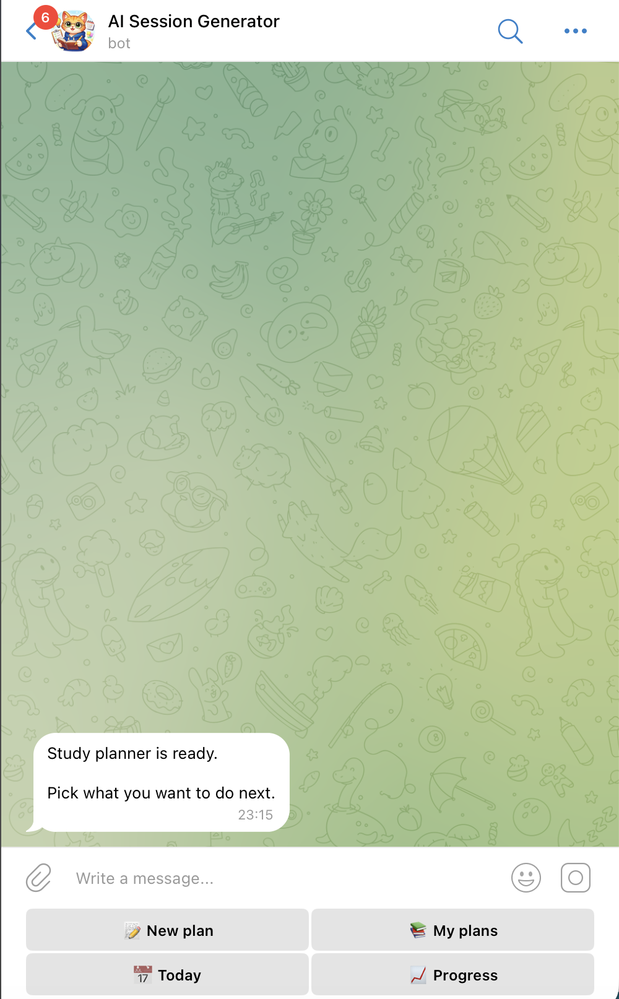
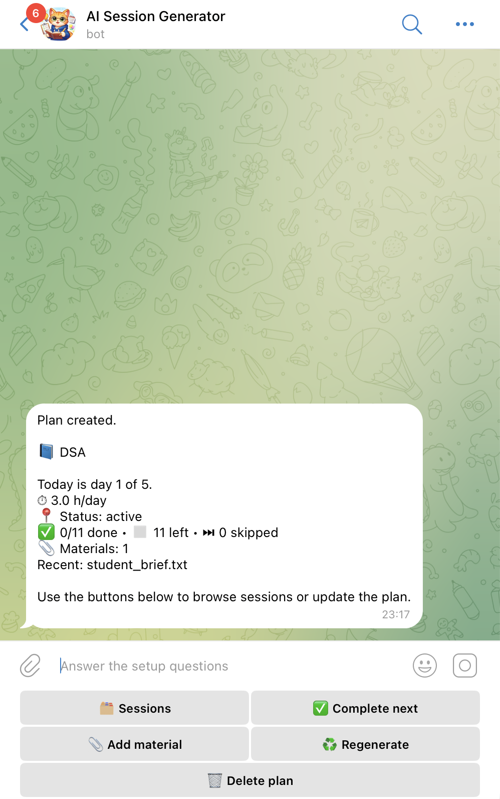
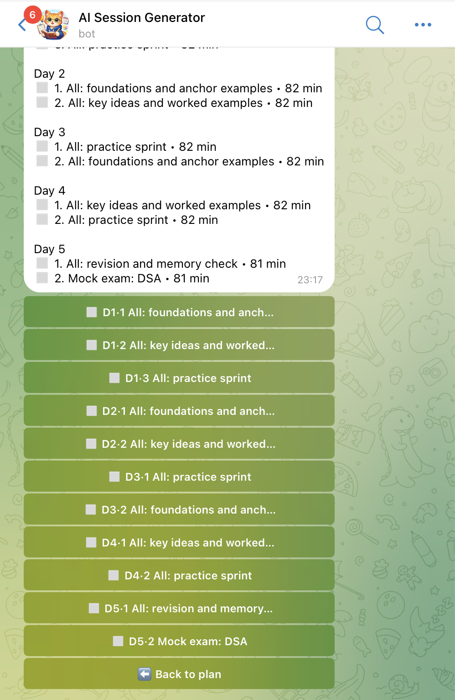
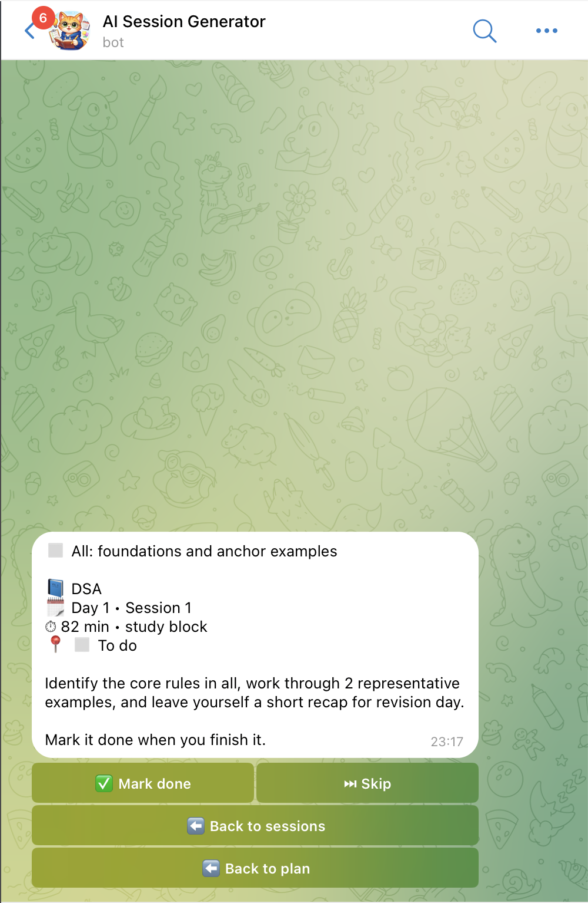
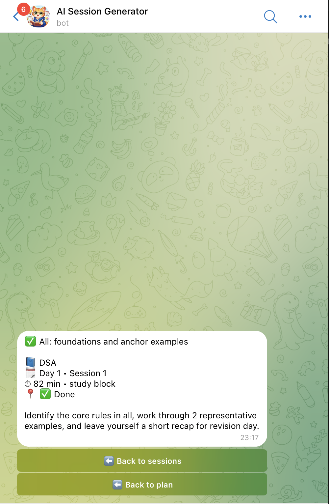

# Study Planner Telegram Bot

Telegram-first study planner that builds day-by-day exam prep plans from user input and study materials.

## Demo

### Screenshots







## Product context

### End users

- University students preparing for exams under time pressure
- Students who already keep notes, PDFs, DOCX files, or screenshots and want them turned into a practical plan

### Problem that the product solves for end users

Students often know the exam date and have materials, but still struggle to turn that into a realistic study schedule. Raw notes are hard to prioritize, and generic study plans are usually too vague to act on.

### Your solution

This product uses a Telegram bot as the main user interface. The bot asks a short set of planning questions, stores the result in a backend, ingests uploaded materials, extracts useful study topics, and generates a structured study plan with individual sessions. Users can then browse sessions in Telegram, mark them as completed or skipped, and track progress.

## Features

### Implemented features

- Telegram bot interface built with `aiogram`
- Study plan creation from:
  - exam/course name
  - days available
  - hours per day
  - weak topics
  - preferred mode (`practice`, `theory`, `balanced`)
- Hybrid plan generation:
  - deterministic schedule builder
  - topic extraction from materials
  - LLM refinement of session titles and descriptions through an OpenAI-compatible endpoint
- Material ingestion for:
  - pasted text
  - PDF
  - DOCX
  - images
- OCR fallback for images in the backend container via `tesseract-ocr`
- Plan regeneration after new materials are uploaded
- Multiple study plans per Telegram user
- Session browsing in Telegram via inline buttons
- Session status updates from Telegram:
  - mark as completed
  - mark as skipped
- Progress summary for the latest plan
- Plan deletion
- PostgreSQL persistence for users, plans, sessions, materials, topics, and LLM request logs
- Included local Qwen proxy service (`qwen-code-api`) for OpenAI-compatible LLM calls

### Not yet implemented features

- Dedicated web frontend or mobile app outside Telegram
- Reminder/notification scheduling for upcoming sessions
- Undo/reset endpoint to move a completed or skipped session back to `pending`
- Manual editing or drag-and-drop reordering of generated sessions
- Persistent bot FSM storage across bot restarts
- End-user documentation assets such as real product screenshots in this repository

## Usage

This product is currently used through Telegram. There is no separate web UI in the repository.

### End-user flow

1. Open the Telegram bot and send `/start`.
2. Tap `New plan`.
3. Answer the bot questions:
   - exam or course name
   - how many days are left
   - how many hours per day are available
   - weak topics
   - whether the plan should emphasize practice, theory, or a balanced mix
4. The bot creates a study plan and shows a plan overview.
5. Tap `Sessions` to browse the generated sessions.
6. Open a session to read its details, then mark it done or skipped.
7. Use `Today` to view the sessions scheduled for the current study day.
8. Use `Progress` to see completed, pending, and skipped session counts.
9. Use `Add material` to send:
   - plain text
   - a PDF
   - a DOCX file
   - an image
10. After material upload, the backend regenerates the plan using the new context.

### How generation works in the current product

- The bot creates a draft plan in the backend.
- The bot uploads a small text brief with the student preferences as a material.
- The backend builds a deterministic session skeleton.
- The backend extracts topics from uploaded materials and user brief text.
- The backend fills the skeleton with topic-aware session drafts.
- The backend optionally refines those drafts through the configured LLM endpoint.

### Components involved in user-facing usage

- `client-telegram-bot/`: Telegram interface
- `backend/`: main application API and business logic
- `postgres`: persistent database
- `qwen-code-api/`: local OpenAI-compatible proxy for LLM calls

The repository also contains `mcp/` and LMS analytics/ETL modules inside the backend. They are real code, but they are auxiliary to the Telegram study planner flow and are not required for normal end-user usage of the bot.

## Deployment

### Target VM OS

Use **Ubuntu 24.04 LTS**.

### What should be installed on the VM

- `git`
- Docker Engine
- Docker Compose plugin
- Optional but recommended for the included Qwen proxy:
  - Qwen Code CLI or another way to place valid Qwen OAuth credentials in `~/.qwen/oauth_creds.json`

Example setup on Ubuntu 24.04:

```bash
sudo apt update
sudo apt install -y git ca-certificates curl
```

Install Docker and Docker Compose using Docker's official instructions for Ubuntu 24.04.

### Step-by-step deployment

#### 1. Clone the repository

```bash
git clone <YOUR_REPOSITORY_URL>
cd se-toolkit-hackathon
```

#### 2. Create the environment file

```bash
cp .env.example .env
```

Edit `.env` and set at least:

- `POSTGRES_DB`
- `POSTGRES_USER`
- `POSTGRES_PASSWORD`
- `BACKEND_API_KEY`
- `TELEGRAM_BOT_TOKEN`
- `TELEGRAM_BACKEND_API_KEY`
- `TELEGRAM_BACKEND_BASE_URL`
- `LLM_API_BASE_URL`
- `LLM_API_MODEL`
- `LLM_PROVIDER`

For the default Compose setup, keep these values aligned:

- `BACKEND_API_KEY` and `TELEGRAM_BACKEND_API_KEY` should match
- `TELEGRAM_BACKEND_BASE_URL` should stay `http://backend:8000`
- `LLM_API_BASE_URL` should stay `http://qwen-code-api:8080/v1` if you use the included proxy

#### 3. Prepare Qwen credentials for the included LLM proxy

The root `docker-compose.yml` starts `qwen-code-api` and mounts `~/.qwen` into the container. That service expects valid Qwen OAuth credentials to exist on the VM.

If you want to use the included proxy:

```bash
qwen login
```

After login, verify that this file exists on the VM:

```bash
~/.qwen/oauth_creds.json
```

If you do not want to use the included proxy, point `LLM_API_BASE_URL` to another OpenAI-compatible endpoint and adjust the Compose setup accordingly.

#### 4. Build and start the services

```bash
docker compose up --build -d
```

This starts:

- `postgres`
- `backend`
- `client-telegram-bot`
- `qwen-code-api`

#### 5. Check service health

Backend health:

```bash
curl http://localhost:${BACKEND_PORT:-8000}/health
```

LLM proxy health:

```bash
curl http://localhost:${QWEN_PORT:-8080}/health
```

Container status:

```bash
docker compose ps
```

Logs:

```bash
docker compose logs -f backend
docker compose logs -f client-telegram-bot
docker compose logs -f qwen-code-api
```

#### 6. Access the product after deployment

- There is no browser frontend in this repository.
- End users access the product by opening the configured Telegram bot and chatting with it.
- Operators can verify the backend at:
  - `http://<VM_IP>:8000/health`
- Operators can verify the included LLM proxy at:
  - `http://<VM_IP>:8080/health`

### Stack

- Python 3.12 for backend and bot
- FastAPI for backend APIs
- `aiogram` for the Telegram bot
- PostgreSQL 16
- SQLModel / SQLAlchemy
- `httpx` for service-to-service HTTP calls
- `pypdf`, `python-docx`, `pytesseract`, `Pillow` for material ingestion
- Docker Compose for local or VM deployment
- FastAPI-based `qwen-code-api` as the included OpenAI-compatible LLM proxy

### Deployment notes and known limitations

- The bot depends on a valid `TELEGRAM_BOT_TOKEN`.
- The backend uses Bearer API key auth for application endpoints.
- The included Qwen proxy depends on valid Qwen OAuth credentials on the VM.
- Image OCR works only when `tesseract` is available; the backend Docker image installs it.
- The backend creates tables automatically with SQLModel metadata. There is no migration system in this repository yet.
- The bot keeps conversational state in memory, so an in-progress multi-step flow can be interrupted by a bot restart.
